# Directly paste and embed in-line images in Sublime just like CherryTree

This guide will help you achieve this:

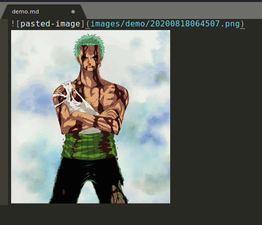


### Installing required packages

First install these two packages from command line:

```bash
sudo apt install flameshot xclip
```

Next install these 3 packages in sublime:

* [sublime_zk](#sublime_zk)
* [imagepaste](#imagepaste)
* [markdownpreview](#markdownpreview)

### sublime_zk
open up sublime 3 and hit `ctrl+shift+p`, type "add repository" and hit enter:

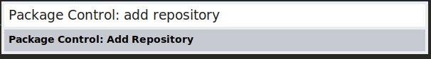

Now an input box will appear at the bottom, paste `https://github.com/renerocksai/sublime_zk` and hit enter:

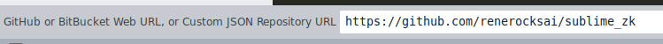

now again hit `ctrl+shift+p`, type "install package" and hit enter. Another prompt will appear shortly, then type "sublime_zk" and hit enter:

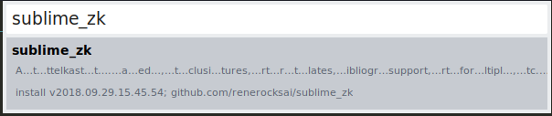

the package will be installed in a few seconds. By default it will change the color_scheme for markdown highlight which we will revert back to default sublime Moonokai color scheme. 

To do this first create a new file and save it as `test.md`

hit `ctrl+shift+p`, type "set syntax markdown" and hit enter. It will switch to default markdown syntax of sublime now. 

Next go to `Preferences > Settings - Syntax Specific`. It will open a new window with two files. Paste the below code in the right pane :

```js
// These settings override both User and Default settings for the sublime_zk syntax
{
    // Which file extensions go with this file type?
    "extensions":
    [
        "md",
        "mdown",
        "mdwn",
        "mmd",
    ], 

    "color_scheme": "Monokai.sublime-color-scheme",
    // Set to true to removing trailing white space on save
    "trim_trailing_white_space_on_save": false
}
```


hit `ctrl+s` and close the window. This will now force default markdown syntax to be selected when you open or create a new markdown file. now close and reopen the test.md file to test it out.

Next we need to change one other setting. 
Go to `Preferences > Package Settings > Sublime ZK > Settings Default` and change the value of "image_maxwidth" to `920`: 

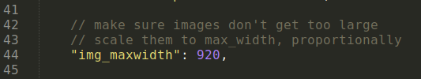

hit `ctrl+s` and close the file.


### imagepaste
open up sublime 3 and hit `ctrl+shift+p`, type "add repository" and hit enter:


Now an input box will appear at the bottom, paste `https://github.com/lukauskas/imagepaste` and hit enter:

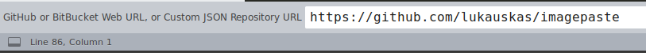

now again hit `ctrl+shift+p`, type "install package" and hit enter. Another prompt will appear shortly, then type "imagepaste" and select the one with all lowercase characters:

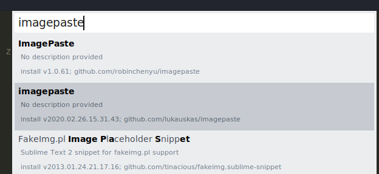


### markdownpreview

hit `ctrl+shift+p`, type "install package" and hit enter. Another prompt will appear shortly, then type "markdownpreview" and hit enter:

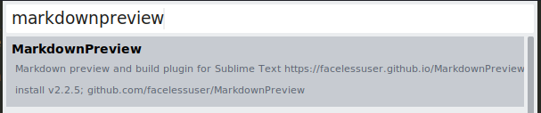


# Setting up Keybindings

* [flameshot keybinding](#flameshot-keybinding)
* [image preview keybinding](#image-preview-keybinding)
* [markdown preview keybinding](#markdown-preview-keybinding)
* [imagepaste keybinding](#imagepaste-keybinding)

#### flameshot keybinding

First add flameshot keyboard shortcut by going to OS settings:

* `Settings manager > keyboard > Application Shortcuts > +Add` in Kali
* or, `settings > Keyboard Shortcuts > +` in Ubuntu. 

Next in the command input  fill in : `flameshot gui`:

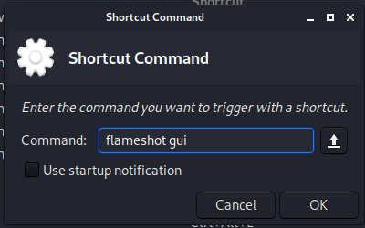

Next it will ask you to press a keyboard combination, I use `ctrl+tab` key so I will press those keys. 
flameshot shortcut is now set, you can verify it by pressing the shortcut keys and marking any area for screenshot: 

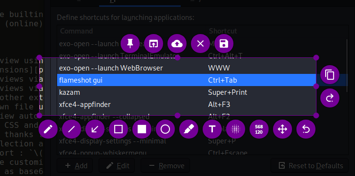


#### image preview keybinding

from within sublime 3, go to `Preferences > Package settings > Sublime ZK > Key Bindings - Default`. A new file will open up, paste these two lines after line 11:

```json
    { "keys": ["ctrl+1"], "command": "zk_show_images"},
    { "keys": ["ctrl+2"], "command": "zk_hide_images"},
```

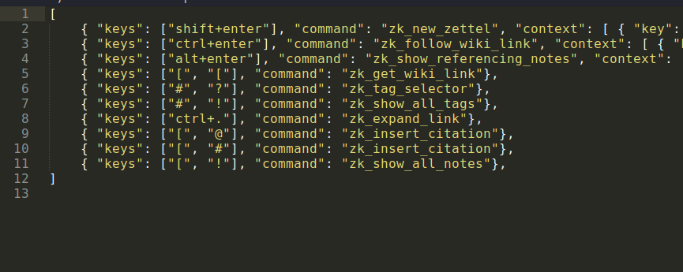


#### markdown preview keybinding

from within sublime 3, go to `Preferences > Key Bindings`. A new window will open up, paste this line inside the brackets in the file on the right pane:

```json
{ "keys": ["alt+m"], "command": "markdown_preview", "args": {"target": "browser", "parser":"markdown"} },
```

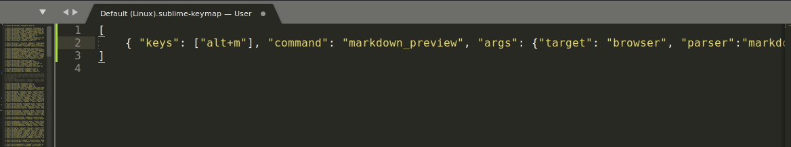

hit `ctrl+s` and close the window.

Next go to `Preferences > Package Settings > Markdown Preview > Settings`. A new window will open up, paste this line inside the brackets in the file on the right pane:

```json
 "browser": "firefox",
```
ps: change firefox to any other browser that you use if needed.

hit `ctrl+s` and close the window.


#### image_paste keybinding

by default imagepaste will overwrite default `ctrl+v` which will cause delay if we try pasting normal text in sublime so we will change this keybinding to `ctrl+shift+v`. 

Go to `Preferences > Browse Packages...` it will open up your packages directory in file explorer:

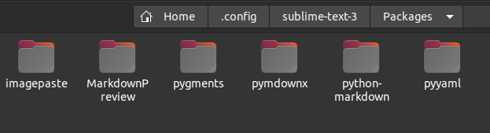

Click on the imagepaste folder and open the "Default (Linux).sublime-keymap" file to edit. Change `ctrl+v` to `ctrl+shift+v`: 

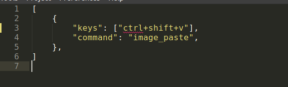

hit `ctrl+s` and close the file.


# Testing

Now let's test everything. restart sublime text for the keybindings to take affect.

Now open up a new file with `ctrl+n` and save it as demo.md

now select any window that you want to take screenshot of and hit `ctrl+tab` to take screenshot, select any area for screenshot:

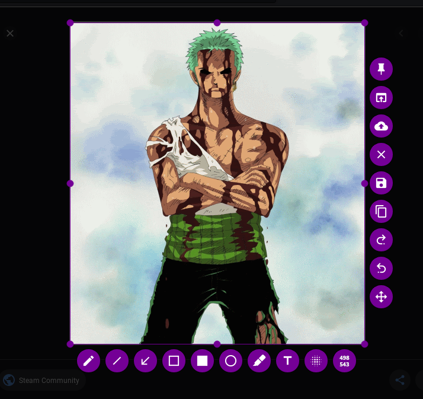

press `ctrl+c` to copy the image in clipboard. now go back to sublime and hit `ctrl+shift+v`:

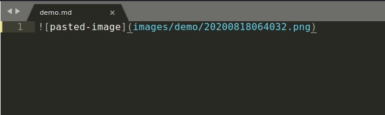

we can see it has been automatically pasted as a markdown syntax. Now Press `ctrl+1` for the image to show:


Press `ctrl+2` to hide again. Let's write down some more markdown text and then test markdown preview:

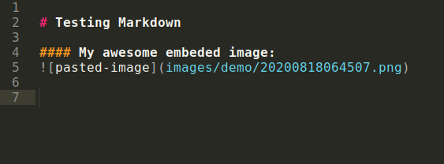

Now press `alt+m` and it will fire up your browser and preview the content: 

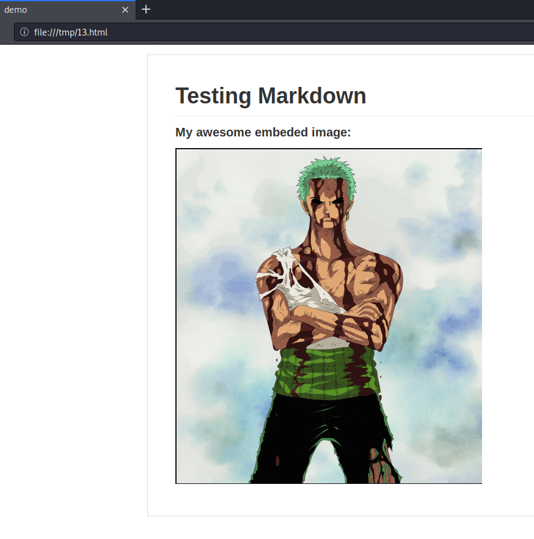

fun fact, I have been taking screenshots and writing this tutorial in the same way: 

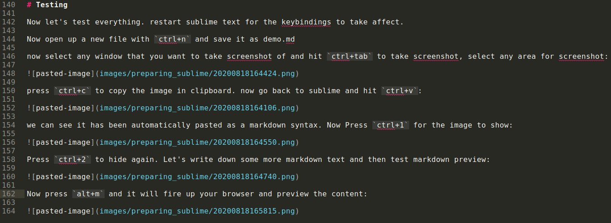